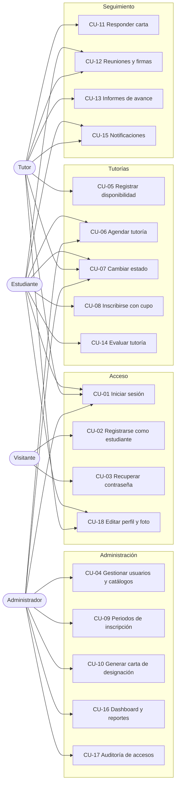

# Casos de uso

## Diagrama

## Descripción de los casos de uso

## CU-01 Iniciar sesión
- **Actores:** administrador, tutor, estudiante.
- **Flujo principal:** el usuario ingresa su usuario o correo y su contraseña; el sistema valida las credenciales y que la cuenta esté `activo`, registra el acceso exitoso en la bitácora y entrega un token firmado junto con los permisos del rol.
- **Flujo alterno:** si las credenciales son incorrectas o la cuenta está inactiva, el sistema responde «Credenciales incorrectas o usuario inactivo» y registra el intento como `fallido`.

## CU-02 Registrarse como estudiante
- **Actor:** visitante.
- **Flujo principal:** completa nombre, apellido, correo, usuario, contraseña, carrera y semestre (el registro público está habilitado solo para estudiantes; los tutores los crea el administrador); el sistema valida los campos y crea la cuenta.
- **Flujo alterno:** si el usuario o el correo ya existen, el sistema informa el dato duplicado.
- **Postcondición:** los administradores reciben una notificación del nuevo registro.

## CU-03 Recuperar y restablecer la contraseña
- **Actor:** usuario con cuenta registrada.
- **Flujo principal:** ver el detalle en [recuperacion-contrasena.md](recuperacion-contrasena.md). El usuario ingresa su correo, el sistema genera un token y muestra el enlace en pantalla; al abrirlo, el usuario define una nueva contraseña y el sistema la actualiza y elimina el token.
- **Flujos alternos:** enlace inválido, ya usado o vencido → el sistema lo informa y pide solicitar uno nuevo; contraseñas que no coinciden o menores a 6 caracteres → el formulario no se envía.

## CU-04 Gestionar usuarios y catálogos
- **Actor:** administrador.
- **Flujo principal:** desde el menú lateral crea, edita, lista o elimina cuentas de usuario, carreras y materias; consulta el padrón de estudiantes y edita sus datos académicos; consulta el directorio de tutores, edita su perfil y las materias que dictan; y consulta los roles del sistema con sus permisos.
- **Postcondición:** al crear un usuario desde el panel, los administradores reciben una notificación.

## CU-05 Registrar disponibilidad
- **Actor:** tutor.
- **Flujo principal:** elige día (lunes a sábado), hora de inicio y hora de fin; el sistema valida que el bloque dure entre 30 minutos y 3 horas y lo guarda.
- **Flujo alterno:** el tutor puede eliminar únicamente sus propios bloques.

## CU-06 Agendar una tutoría
- **Actores:** estudiante, administrador.
- **Flujo principal:** se elige tutor, materia, fecha, horario, modalidad y lugar o enlace; el sistema valida las reglas RN-01 a RN-06 y crea la tutoría en estado `pendiente`.
- **Flujos alternos:** fecha pasada, domingo, duración inválida, materia no asignada al tutor, tutor sin disponibilidad o cruce de horario → el sistema rechaza el agendamiento con el mensaje correspondiente.

## CU-07 Cambiar el estado de una tutoría
- **Actores:** tutor, estudiante, administrador.
- **Flujo principal:** el tutor confirma, marca como realizada o cancela una tutoría suya; el estudiante cancela la suya; el administrador puede aplicar cualquier cambio permitido. Ver [estados-tutoria.md](estados-tutoria.md).

## CU-08 Inscribirse en una tutoría
- **Actor:** estudiante.
- **Precondición:** existe un periodo de inscripción activo.
- **Flujo principal:** el estudiante ve las tutorías futuras con cupo, elige una y se inscribe; el sistema descuenta un cupo.
- **Flujos alternos:** sin periodo activo, tutoría sin cupos, tutoría realizada o cancelada, o ya inscrito → el sistema rechaza la inscripción.

## CU-09 Gestionar periodos de inscripción
- **Actor:** administrador.
- **Flujo principal:** crea un periodo con nombre, descripción y fechas de inicio y fin, y lo activa; al activar uno, el periodo activo anterior se desactiva.
- **Flujo alterno:** si la fecha de fin es anterior a la de inicio, el sistema rechaza el periodo.

## CU-10 Generar carta de designación
- **Actor:** administrador.
- **Flujo principal:** desde la pantalla de tutorías elige el estudiante, el tutor y la modalidad de graduación (Proyecto de Grado, Tesis o Trabajo Dirigido, según el formulario); el sistema crea la tutoría en estado `pendiente` y la carta en estado `pendiente`.

## CU-11 Responder una carta de designación
- **Actor:** tutor.
- **Flujo principal (aceptar):** el tutor abre la carta pendiente, elige «Aceptar y Firmar»; la carta pasa a `aceptada`, se registra la fecha de firma y la tutoría pasa a `asignada`.
- **Flujo alterno (rechazar):** elige «Rechazar» y un motivo (capacidad excedida, falta de tiempo o conflicto de interés / causa justificada); la carta pasa a `rechazada` y la tutoría a `en_reasignacion`.
- **Otras acciones:** ver la carta y **imprimirla**.

## CU-12 Registrar y firmar reuniones
- **Actores:** tutor (registra y firma), estudiante (firma).
- **Flujo principal:** el tutor registra la reunión con fecha, horario, lugar o enlace, asistencia, evidencia y observaciones; luego el tutor y el estudiante firman cada uno desde su cuenta.
- **Flujos alternos:** hora de fin anterior a la de inicio, tardanza sin minutos o evidencia con URL inválida → el sistema rechaza el registro.

## CU-13 Registrar informes de avance
- **Actor:** tutor.
- **Flujo principal:** el sistema propone el siguiente número de informe; el tutor registra la descripción, el porcentaje de avance y, opcionalmente, la fecha límite.
- **Flujo alterno:** si ya existe un informe con ese número en la tutoría, el sistema lo rechaza.

## CU-14 Evaluar una tutoría
- **Actor:** estudiante.
- **Precondición:** la tutoría está `realizada`.
- **Flujo principal:** el estudiante califica de 1 a 5 y deja un comentario; el sistema guarda la evaluación.
- **Flujo alterno:** si la tutoría ya fue evaluada, el sistema lo impide.

## CU-15 Consultar notificaciones
- **Actores:** todos.
- **Flujo principal:** la campana del encabezado muestra las notificaciones no leídas; desde la bandeja de notificaciones el usuario las revisa y las marca como leídas, una por una o todas a la vez.

## CU-16 Consultar dashboard y reportes
- **Actores:** todos (dashboard), administrador (reportes).
- **Flujo principal:** el dashboard muestra indicadores según el rol; en reportes el administrador filtra por fecha, estado, carrera y materia y visualiza los resultados en gráficos.

## CU-17 Consultar auditoría de accesos
- **Actor:** administrador.
- **Flujo principal:** consulta la bitácora con usuario, fecha y hora, IP y resultado de cada intento de acceso.

## CU-18 Editar perfil y foto
- **Actores:** estudiante, tutor.
- **Flujo principal:** actualiza sus datos de contacto y sube una foto (JPG, PNG o WebP de hasta 2 MB); el sistema reemplaza la foto anterior.
