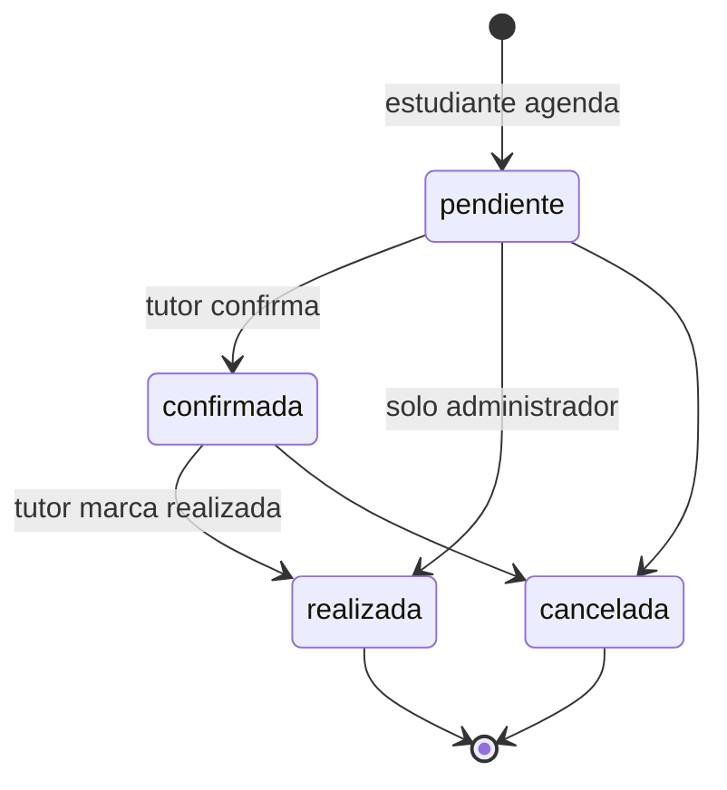
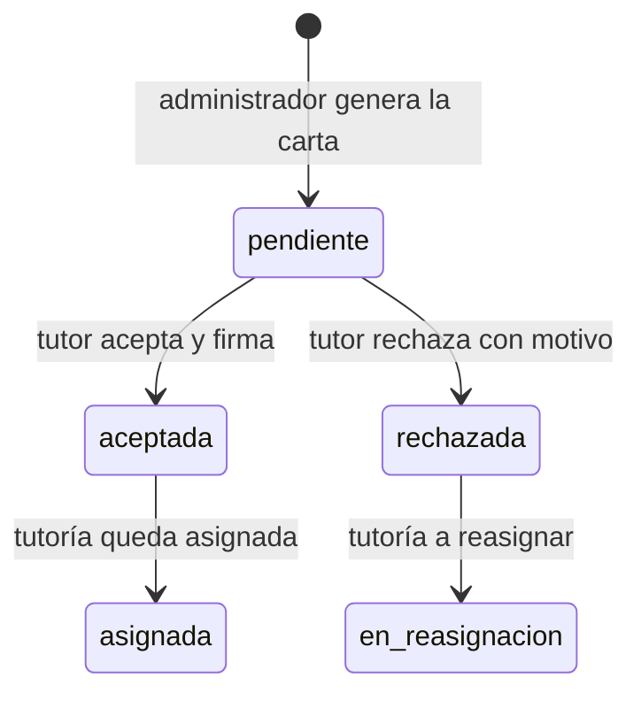

# Estados de la tutoría y de la carta de designación

## Diagramas de estados (Mermaid)





## 1. Estados de la tutoría (`tutorias.estado`)

| Estado | Significado | Quién lo produce |
|---|---|---|
| `pendiente` | Tutoría solicitada, aún sin confirmar | Sistema al agendar |
| `confirmada` | El tutor confirmó la sesión | Tutor o administrador |
| `realizada` | La sesión se llevó a cabo; habilita la evaluación del estudiante | Tutor o administrador |
| `cancelada` | Sesión cancelada | Estudiante (la suya), tutor o administrador |
| `asignada` | El tutor aceptó la carta de designación | Sistema, al aceptar la carta |
| `en_reasignacion` | El tutor rechazó la carta de designación | Sistema, al rechazar la carta |

## 2. Transiciones de la gestión de tutorías

```
pendiente ──► confirmada ──► realizada
    │              │
    └──────────────┴──────────► cancelada
```

Reglas (`api/tutorias/index.php`):

- Un estudiante solo puede cancelar sus propias tutorías.
- Un tutor puede confirmar, marcar como realizada o cancelar las tutorías asignadas a él; no puede devolverlas a `pendiente`.
- Una tutoría `pendiente` solo pasa a `realizada` directamente si lo hace el administrador.
- Una tutoría `realizada` o `cancelada` no puede cambiar de estado.

## 3. Estados de la tutoría en el flujo de designación

```
(carta generada) ──► pendiente ──► [tutor acepta]  ──► asignada
                                └► [tutor rechaza] ──► en_reasignacion
```

## 4. Estados de la carta de designación (`cartas_designacion.tipo_firma`)

```
pendiente ──► aceptada
    └───────► rechazada (con motivo)
```

| Estado | Significado |
|---|---|
| `pendiente` | Carta generada, esperando respuesta del tutor |
| `aceptada` | El tutor la aceptó y firmó (`fecha_firma`) |
| `rechazada` | El tutor la rechazó indicando el motivo (`motivo_rechazo`) |

Una carta ya respondida no puede responderse otra vez.

## 5. Estados de la inscripción (`tutoria_estudiante.estado_asignacion`)

| Estado | Significado |
|---|---|
| `inscrito` | El estudiante ocupa un cupo de la tutoría |
| `cancelado` | La inscripción fue cancelada; el estudiante puede volver a inscribirse mientras haya cupo |
