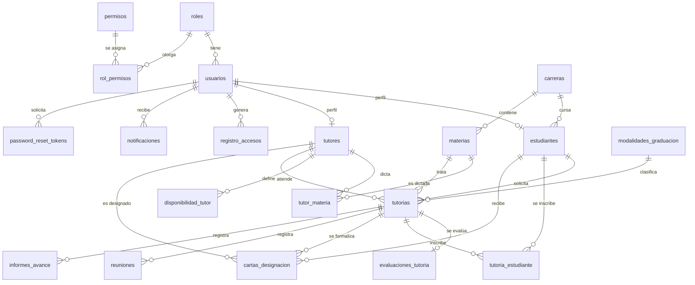

# Modelo entidad-relación

Base de datos `tutorias_db` (MySQL 8.0). Los campos de cada tabla están en [diccionario-datos.md](diccionario-datos.md).

## 1. Diagrama

## 2. Grupos de tablas

| Grupo | Tablas |
|---|---|
| Seguridad y acceso | `roles`, `usuarios`, `permisos`, `rol_permisos`, `registro_accesos`, `password_reset_tokens` |
| Catálogos | `carreras`, `materias`, `estudiantes`, `tutores`, `tutor_materia` |
| Agenda | `disponibilidad_tutor`, `tutorias`, `evaluaciones_tutoria` |
| Inscripción | `periodos_inscripcion`, `tutoria_estudiante` |
| Seguimiento de la tutoría | `modalidades_graduacion`, `cartas_designacion`, `reuniones`, `informes_avance` |
| Comunicación | `notificaciones` |

## 3. Relaciones clave

- Un `usuario` pertenece a un `rol`. Si es estudiante o tutor, tiene además un registro en `estudiantes` o `tutores` (relación 1 a 1 por `id_usuario`).
- Un tutor dicta varias materias y una materia puede ser dictada por varios tutores (`tutor_materia`, relación N a M).
- Una `tutoria` pertenece a un estudiante, un tutor y una materia; tiene como máximo una `evaluacion_tutoria`.
- Una tutoría grupal admite varios estudiantes inscritos (`tutoria_estudiante`) hasta su `cupo_maximo`.
- Una `tutoria` puede tener varias `cartas_designacion` (cada carta queda guardada con su estado), varias `reuniones` y varios `informes_avance`.
- `notificaciones`, `registro_accesos` y `password_reset_tokens` apuntan siempre a un `usuario`.
- Los permisos se asignan a los roles mediante `rol_permisos` (N a M).
- `periodos_inscripcion` no se relaciona por clave foránea: la inscripción consulta el periodo que esté activo en ese momento.
