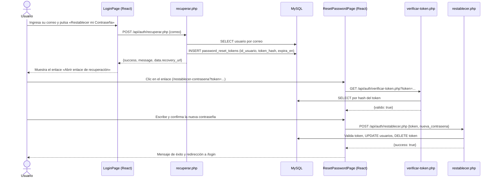

# Flujo de recuperación de contraseña con token en pantalla

Este mecanismo implementa la lógica de seguridad y de base de datos de un flujo real de recuperación de contraseña, pero resuelve la **entrega del enlace** mostrándolo directamente en la interfaz, porque el proyecto no dispone de un servidor SMTP y los correos de prueba registrados en la base de datos son ficticios (por ejemplo `carlos@correo.com`).

Se trata de un **modo de desarrollo (sandbox)**: la generación, el almacenamiento y la validación del token son los de un entorno de producción; lo único que cambia es el canal por el que llega el enlace al usuario.

Commits: `8560fa2` (solicitud del enlace) y `0a301a4` (verificación y restablecimiento).

## 1. Archivos involucrados

| Capa | Archivo | Función |
|---|---|---|
| Frontend | `frontend/src/pages/auth/LoginPage.jsx` | Pestaña «Recuperar Contraseña»: formulario de correo y recuadro con el enlace |
| Frontend | `frontend/src/pages/auth/ResetPasswordPage.jsx` | Vista pública `/restablecer-contrasena` con el formulario de nueva contraseña |
| Frontend | `frontend/src/routes/AppRouter.jsx` | Registra la ruta pública `/restablecer-contrasena` |
| Backend | `api/auth/recuperar.php` | Genera el token y devuelve el enlace |
| Backend | `api/auth/verificar-token.php` | Comprueba que el token exista y no haya vencido |
| Backend | `api/auth/restablecer.php` | Consume el token y actualiza la contraseña |
| Base de datos | `password_reset_tokens` | Guarda el token cifrado, el usuario y la fecha de vencimiento |

## 2. Secuencia



## 3. Paso a paso

### Paso 1 — Solicitud desde el frontend (`LoginPage.jsx`)

1. El usuario abre la pantalla de acceso, elige «¿Olvidaste tu contraseña?» y ve la pestaña **Recuperar Contraseña**, donde ingresa su correo (incluso un correo ficticio que esté registrado en la base de datos).
2. Al pulsar **Restablecer mi Contraseña**, el frontend envía una petición `POST` con Axios a `api/auth/recuperar.php` con el cuerpo `{ "correo": "..." }`.

### Paso 2 — Generación del token en el backend (`recuperar.php`)

1. **Validación del correo:** si el formato no es válido responde error 400.
2. **Búsqueda de la cuenta:** PHP consulta con PDO y sentencia preparada si el correo existe en la tabla `usuarios` (sin distinguir mayúsculas).
3. **Generación aleatoria:** si el usuario existe, se crea el token con `bin2hex(random_bytes(32))` (64 caracteres hexadecimales).
4. **Persistencia y expiración:** en `password_reset_tokens` se inserta el `id_usuario`, el **hash SHA-256 del token** (el token original nunca se guarda) y la fecha de vencimiento, calculada **15 minutos** después de la solicitud.
5. **Respuesta JSON:** en lugar de enviar un correo, el endpoint construye la URL de restablecimiento y la devuelve:

```json
{
  "success": true,
  "message": "Si el correo está registrado, recibirás instrucciones para recuperar tu contraseña.",
  "data": {
    "recovery_url": "http://localhost:5173/restablecer-contrasena?token=a8f9c1b2e3..."
  }
}
```

Si el correo no está registrado, la respuesta es la misma pero con `recovery_url: null`, de modo que el mensaje no revela qué correos existen.

### Paso 3 — Enlace en pantalla (`LoginPage.jsx`)

1. Al recibir `success: true` y un `recovery_url`, la vista despliega un recuadro azul con la etiqueta **[ENTORNO DE DESARROLLO]** y el enlace **Abrir enlace de recuperación**.
2. Al hacer clic, la aplicación navega (sin recargar la página) a `/restablecer-contrasena?token=...`.

### Paso 4 — Restablecimiento y consumo del token

1. **Captura del token:** `ResetPasswordPage.jsx` lee el parámetro `token` de la URL con `useSearchParams()` y lo verifica con `GET api/auth/verificar-token.php`. Mientras valida muestra «Validando enlace de recuperación…»; si el token no existe o venció, muestra «Enlace Inválido».
2. **Formulario:** con el token válido aparecen los campos **Nueva contraseña** y **Confirmar contraseña**. El frontend exige al menos 6 caracteres y que ambos campos coincidan.
3. **Envío:** se hace `POST` a `api/auth/restablecer.php` con `{ token, nueva_contrasena }`.
4. **Validación de integridad en la base de datos** (dentro de una transacción):
   - Busca en `password_reset_tokens` el hash del token recibido (`SELECT ... FOR UPDATE`).
   - Si no existe (inválido o ya usado) responde HTTP 400: *«El enlace de recuperación es inválido o ya fue utilizado.»*
   - Si `expira_en` ya pasó responde HTTP 400: *«El enlace de recuperación ha expirado. Por favor, solicita uno nuevo.»*
5. **Actualización de la clave cifrada:** con el token validado, PHP genera el nuevo hash con `password_hash($nueva_contrasena, PASSWORD_DEFAULT)` y ejecuta un `UPDATE` sobre `usuarios.contrasena_hash` del usuario asociado.
6. **Destrucción del token:** ejecuta un `DELETE` en `password_reset_tokens` para que el enlace no pueda reutilizarse, y confirma la transacción.
7. **Redirección:** la API responde `success: true`, React muestra el mensaje de éxito y redirige automáticamente a `/login` para que el usuario ingrese con sus nuevas credenciales.

## 4. Medidas de seguridad implementadas

| Medida | Dónde |
|---|---|
| Token aleatorio criptográficamente seguro (`random_bytes(32)`) | `recuperar.php` |
| Token guardado solo como hash SHA-256 | `recuperar.php`, `restablecer.php` |
| Vencimiento del token a los 15 minutos de generado, validado en el servidor | `verificar-token.php`, `restablecer.php` |
| Un solo uso: el token se elimina al restablecer | `restablecer.php` |
| Restablecimiento dentro de una transacción con bloqueo de fila | `restablecer.php` |
| Mensaje idéntico exista o no el correo | `recuperar.php` |
| Contraseña nueva guardada con `password_hash` | `restablecer.php` |
| Validaciones repetidas en backend (no solo en la interfaz): correo válido, contraseña de 6 o más caracteres | `recuperar.php`, `restablecer.php` |
| Consultas con sentencias preparadas (PDO) | todos los endpoints |

## 5. Decisión de diseño: entrega del enlace sin correo

La lógica de seguridad (generar, guardar, validar y consumir el token) está separada del canal de entrega. Por la falta de un servidor SMTP y por el uso de correos de prueba ficticios, el canal de entrega del proyecto es la pantalla. Reemplazarlo por el envío de un correo solo afectaría al punto donde `recuperar.php` devuelve el enlace; el resto del flujo permanece igual.
