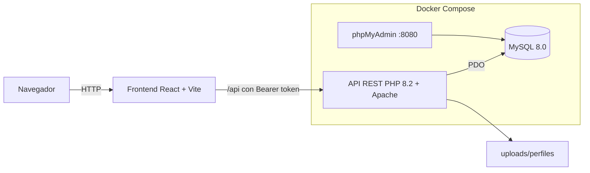

# Alcance del proyecto

## 1. Objetivo

Sistema web para gestionar tutorías académicas en la UPDS Sede Tarija: permite que los estudiantes soliciten o se inscriban a tutorías, que los tutores administren su disponibilidad y den seguimiento a sus estudiantes, y que la administración controle usuarios, periodos, cupos, reportes y auditoría de accesos.

## 2. Tecnologías

| Capa | Tecnología |
|---|---|
| Frontend | React 19, Vite, React Router, Axios, Recharts, lucide-react |
| Backend | PHP 8.2 sobre Apache, API REST en `api/`, acceso a datos con PDO y consultas preparadas |
| Base de datos | MySQL 8.0 (script `database/init.sql`) y phpMyAdmin para administración |
| Entorno | Docker Compose: `web` (puerto 8000), `db` (3306) y `phpmyadmin` (8080); el frontend corre con Vite en el puerto 5173 y redirige `/api` y `/uploads` al puerto 8000 |
| Autenticación | Token firmado con HMAC-SHA256 enviado como `Authorization: Bearer` |
| Zona horaria | `America/La_Paz` en PHP y `-04:00` en MySQL |

### Arquitectura

## 3. Roles

| Rol | Descripción |
|---|---|
| administrador | Gestiona usuarios, roles, catálogos, periodos de inscripción, cartas de designación, reportes y auditoría |
| tutor | Registra su disponibilidad, atiende sus tutorías, responde cartas de designación, registra reuniones e informes de avance |
| estudiante | Solicita o se inscribe a tutorías, cancela las propias, firma reuniones y evalúa tutorías realizadas |

## 4. Módulos implementados

1. Acceso: inicio de sesión, registro público de estudiantes, recuperación y restablecimiento de contraseña.
2. Usuarios, roles y permisos (RBAC).
3. Catálogos: carreras, materias, tutores, estudiantes y asignación de materias a tutores.
4. Disponibilidad de tutores.
5. Tutorías: agendamiento con validaciones, cambio de estado, acta imprimible.
6. Periodos de inscripción, cupos e inscripción de estudiantes.
7. Carta de designación de tutor (generación, aceptación o rechazo con motivo, impresión).
8. Reuniones con evidencia y firmas del tutor y del estudiante.
9. Informes de avance.
10. Evaluaciones de tutorías.
11. Notificaciones internas (campana y bandeja).
12. Dashboard por rol y reportes con filtros para el administrador.
13. Auditoría de accesos.
14. Perfil de usuario con foto.

## 5. Datos de prueba

`database/init.sql` crea tres usuarios de demostración, uno por rol: `admin`, `tutor1` y `estudiante1`. Todos usan la contraseña de prueba definida en el propio script.
